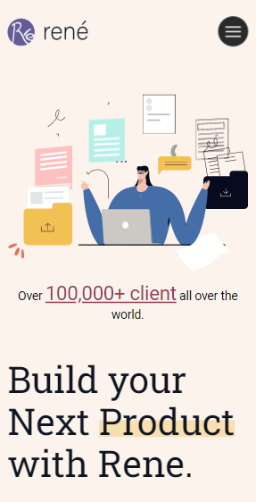
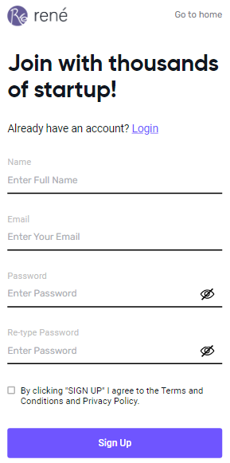
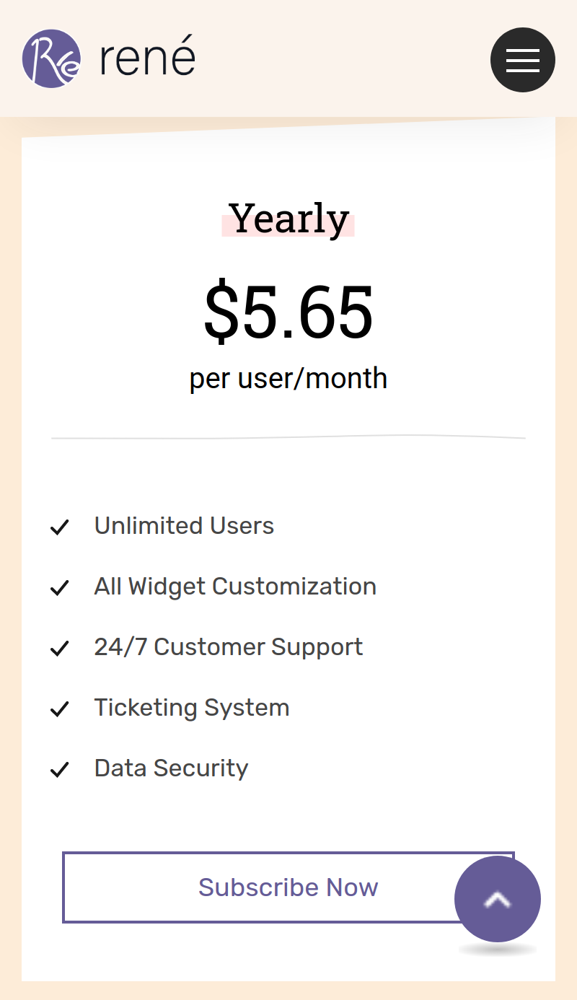
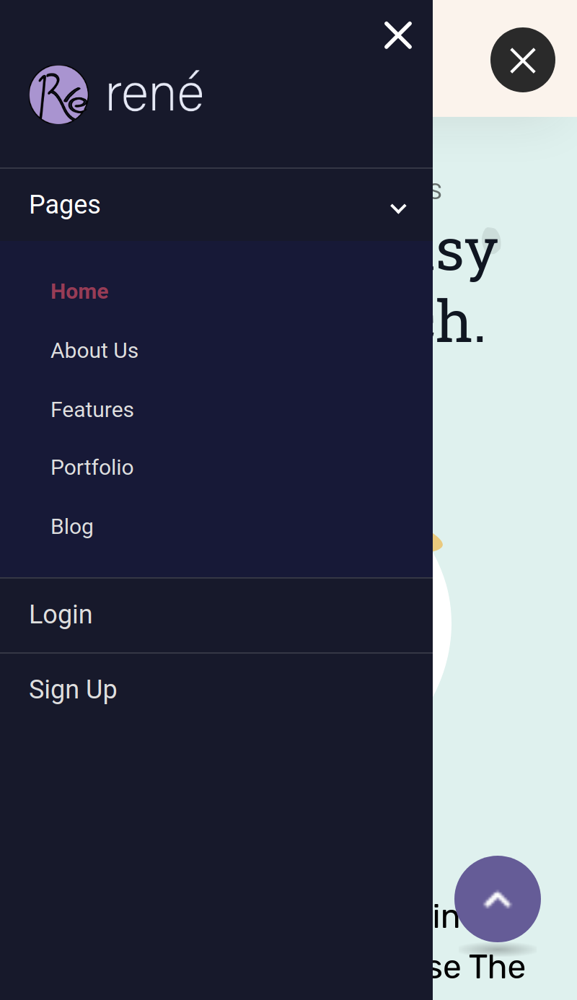

# Rene

> A SaaS Project Management App Landing Website. The design is modern, beautiful and responsive. It displays your content nicely on Desktop, Laptop, iPad, iPhone, Android Mobile, and tablets.

## A Screenshot of the Homepage

## Collective Screenshots of the Mobile Version

  
  
  
  

## A Demo for the App

- [Demo](https://rene.omarramoun.com/)

## Built With

- Languages: _**HTML5/Semantics, CSS3/SASS, JS/ES6**_
- Framework: _**React, Redux, Styled-Components, React-Router**_
- Technologies used: _**GIT, GITHUB, LINTERS**_

## Features

- Based on Bootstrap CSS
- SVG icons
- Nice and Clean Design
- Detailed documentation
- AOS animation used
- CSS3 Animations
- Sticky Navigation
- Clean Mobile Navigation
- Fully Responsive to all devices
- Cross browser compatible
- SEO Compatible

## Authors

👤 **Ramoun**

- **GitHub**: 
- **Twitter**: 
- **LinkdIn**: 
- **Website**: 

## 🤝 Contributing

Contributions, issues, and feature requests are welcome!

Feel free to check the [issues page](../../issues).

## Show your support

Give a ⭐️ if you like this project!
